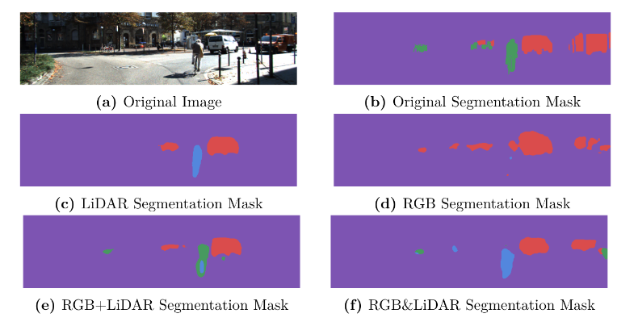

# Improving Image Segmentation Using LiDAR Data

## Overview

This project investigates how LiDAR data can be fused with RGB images to improve semantic segmentation in autonomous driving scenarios. We design and evaluate deep learning models under different sensor fusion strategies and compare their performance through a systematic ablation study.

 By Virgilio Strozzi and Luca Brodo at École polytechnique, école d'ingénieur (December 2023)
## Abstract

Semantic segmentation is a core task in autonomous driving, requiring accurate pixel-level understanding of complex scenes. RGB cameras provide rich visual information but lack depth, while LiDAR sensors offer precise geometric structure with limited semantic detail.

In this work, we explore multiple RGB–LiDAR fusion strategies using encoder–decoder neural networks. We compare models trained with RGB-only, LiDAR-only, and fused inputs, and analyze their performance across different architectures. The results show that RGB information remains dominant, while LiDAR contributes to sharper boundaries and improved robustness in specific scenarios, although limited dataset size constrains overall gains.

## Architectures Tested

We evaluate UNet++-based segmentation models with different ResNet backbones and input modalities:

### Backbone architectures
- ResNet18  
- ResNet34  
- ResNet50  
- ResNet101  

### Input modalities
- **RGB** – camera images only  
- **LiDAR** – depth maps derived from LiDAR  
- **LiDAR & RGB (concat)** – channel-wise concatenation  
- **LiDAR + RGB (sum)** – weighted fusion of depth and RGB channels  

## Results

Key findings from the experiments:

- RGB-only models achieve the highest overall IoU scores.
- LiDAR-only models produce sharper object boundaries but lower semantic accuracy.
- Fusion strategies yield mixed results:
  - Concatenation often degrades performance due to incompatibility with pretrained RGB encoders.
  - Weighted fusion can improve robustness but tends to overfit with limited data.
- Larger backbones do not consistently improve performance due to dataset scarcity.

## Key Contributions

- Implementation of a complete RGB–LiDAR fusion pipeline for semantic segmentation.
- Projection of LiDAR point clouds into camera space and depth map generation.
- Systematic ablation study across fusion strategies and network backbones.
- Quantitative and qualitative analysis of multimodal segmentation performance.
- Insights into the limitations and potential of LiDAR–RGB fusion in deep learning.
